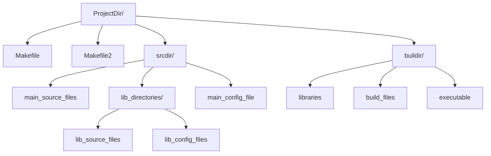

# Introduction

This is a build solution to build a c++ program along with it's "libraries". It can be used in a project where one is required to develop
a library simultaneously with the program. This Makefile automatically detects the source files in the project tree (using the `wildcard`
function), and generates the depandancy list to produce an executable and the libraries for it. The libraries can be statically or dynamically
linked. This is one of a set of similar sister projects used to build c and c++ projects.

## How To Use

Using this build solution is simple. All you need to do is copy [Makefile](Makefile) and [Makefile2](Makefile2) into your project directory.

```bash
cd /path/to/your/project/
```

then

```bash
curl -sL https://raw.githubusercontent.com/SidhBhat/make-build_Cpp_app/main/Makefile > Makefile
curl -sL https://raw.githubusercontent.com/SidhBhat/make-build_Cpp_app/main/Makefile2 > Makefile2
# be sure to write the raw content to the correct filenames
```

Now you're going to want to set _these_ variables inside the makefile, to specify where to look for sources and where to build them.

```make
#build configuration
override srcdir     = src/
override buildir    = build/
#program Name
prog_name           = main
```

You are pretty much set now. However here are the compile time variables you can set in the makefile, or through the commandline:

```make
# Compiler options
CXX        = g++
CXXLIBS    =
CXXFLAGS   = -g -O -Wall
RPATH      =
# Archive options
AR         = ar
ARFLAGS    = crs
# Install location
DESTDIR    =
prefix     = /usr/local/
```

There is one specail flag, that controls whether the libraries should be dynamically linked or not.

```make
# set this variable to any value to make shared libraries (cleaning existing build files may be necessary)
SHARED =
```

By calling the target `generate-config-files`, the makefile will write several `*.mk` files into the source directory.

```bash
make generate-config-files
```

These files will be included into the make process, and act as configuration files. You can specify the libraries to use and any external
libraries if required here. The configuration files can also control whether a specific library will be dynamic linked or not, regardless of the
global `SHARED` flag. There will be one config file for each library, and one for the executable. See `The Directory Structure` below for more info.

## The Directory Structure

The Directory Structure consists of a source directory and a build directory. Ideally you would keep these in your project tree, but technically
they can be anywhere. The makefile expects all source files to be directly in `srcdir/`. Every directory inside `srcdir/` that has valid c++ files
inside will be taken as a library, the name of the library being the same as directory name. And all build activities are confined to `buildir/`.
The configuration files are written into the directory of each library, and the config for the executable is writted directly into `srcdir/`

The file names for the configuration files can be modified by the following make variables:

```
override libconfigfile  = config.mk
override mainconfig     = libconfig.mk
```

<!-- Mermaid rendering of directory structure  -->


## Sibling Projects

This Makefile is one among a set of make solutions to build c and c++ projects

  - [make-build_C_app](https://github.com/SidhBhat/make-build_C_app)
  - [make-build_Cpp_app\*](https://github.com/SidhBhat/make-build_Cpp_app)
  - [make-build_C_lib](https://github.com/SidhBhat/make-build_C_lib)
  - [make-build_Cpp_lib](https://github.com/SidhBhat/make-build_C_lib)
  - [simple-make-build](https://github.com/SidhBhat/simple-make-build)

## Contributing
If you would like to contribute, you can start by simply creating a pull request `:)`.
